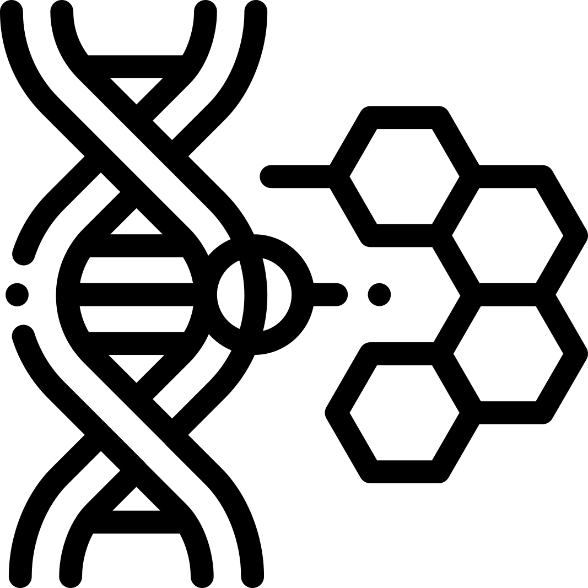

# ky-nf-capstone

Detection of epigenetic DNA modification is important for several research applications, including cancer research and analysis of evolutionary mechanisms. However, currently established methods are not powerful enough. To tackle this problem, an AI-based analysis of nanopore sequencing data was implemented in this project.

Data was received from https://github.com/tleonardi/nanocompore/

# Structure of this repository:

## 1_Data_Mining_EDA

* Data import
* Feature engineering
* Data exploration
* Yeast data import
* Data export

## 2_Predictive_Modeling

